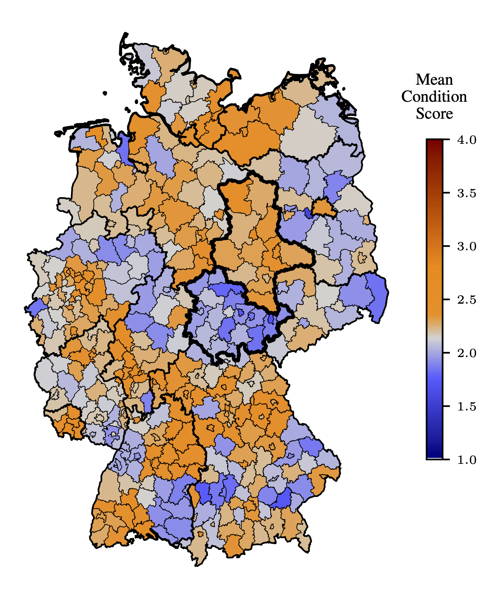
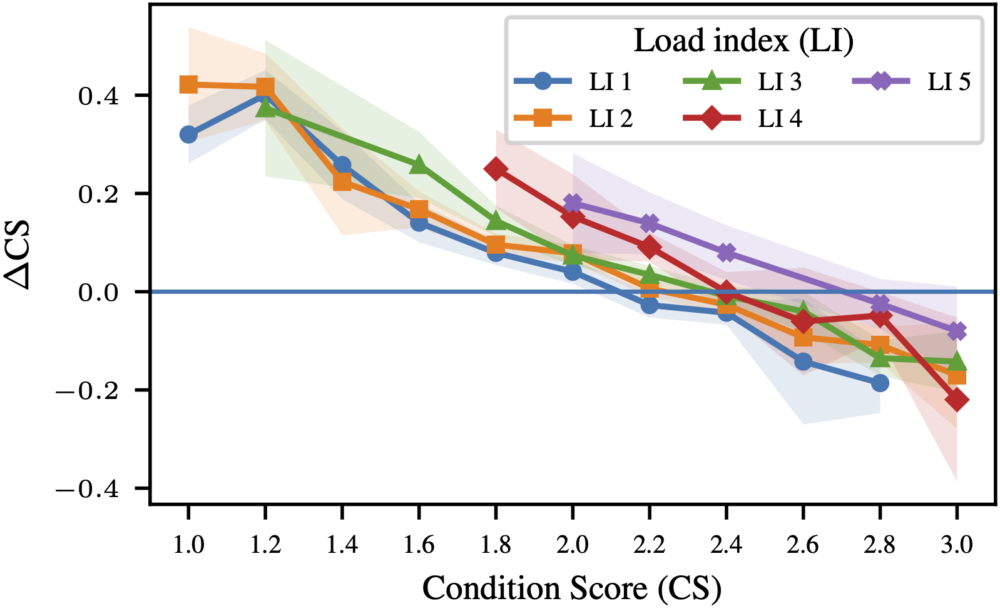

# Germany’s Bridges: Structural Condition and Load Capacity

This repo contains the code and report for the group project to analyse the condition and load of the bridges in Germany. It was part of the lecture *Data Literacy* at the University of Tübingen. An interactive map of Germany to explore condition scores, load indices, construction years, material of bridges and a lot more can be found [here](). 

---

There are regional differences regarding the mean condition score per district. Thuringia corresponds to the state with the lowest mean condition score, while Saxony-Anhalt is one of the states with the highest mean condition score. Nevertheless, our feature set (such as construction year, length, width, material, etc.) is insufficient to identify explanatory mechanisms. 

The load index is another indication for the condition of a bridge. It is correlated to the condition score even though a good load index does not imply a good condition score and vice versa. When comparing the same dataset of 2024 and 2025 regarding the condition scores, one can see that bridges with load index 4 and 5 (poor) have generally higher condition scores (poor). 

## Structure

The data that was used can be found in `./data`, while all the implementations and jupyter notebooks are stored in `./code`. The report is stored in `./doc`. 
